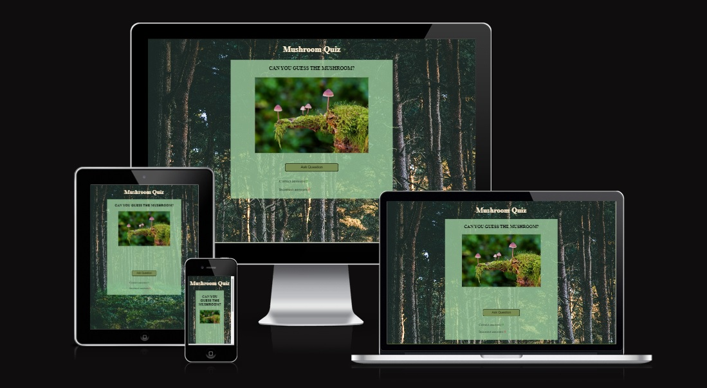
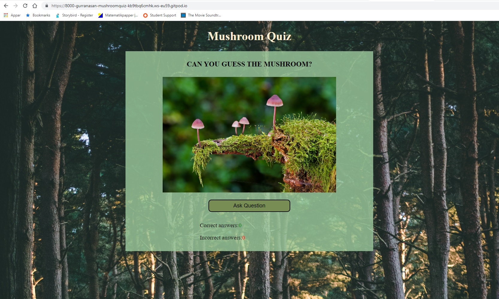
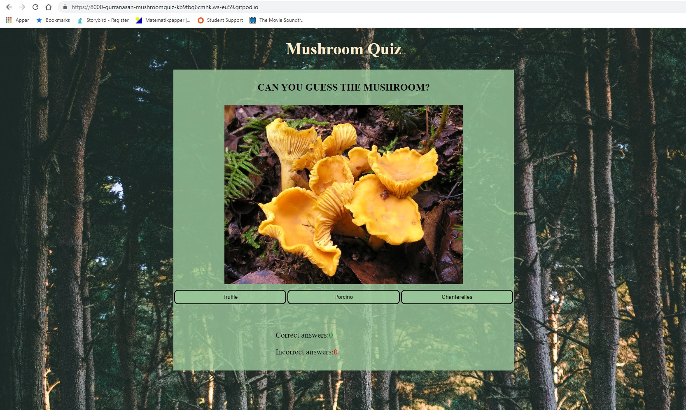
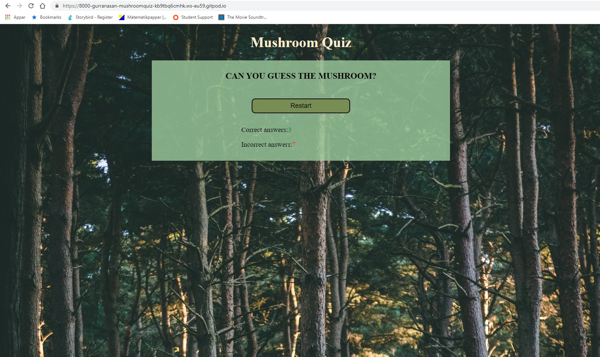

# Mushroom Quiz

This page include a quiz about mushrooms. You get a picture with a mushroom on and you need to press the button with the right answer and you get correct or incorrect score.   

## Features

### Existing Features

#### Start

This is the start screen. Here you see a picture of a mushroom and get a button to start the quiz.  

#### Questions

In this screen you get a new picture of a mushroom and three new buttons with answers. When you press the right answer you get a point to the correct score counter or if you are wrong you get a point to the incorrect counter. When you have pressed an answer you get a new question.   

#### Endscreen

Here the pictures will disappear and you will get a restart button to start over the quiz with.   

### Features Left to Implement 
In the future i will change the style of the answercounters and make them bigger in the endscreen. 
A feature that is left to implement is a function that will show right and wrong answers when you press the buttons, so you will learn. 

## Testing
I have tried the site in Chrome and Microsoft edge and it worked the same in both browsers.
I tried the page on a Samsung galaxy s20 and it worked as it should. 
I confirmed that my site is responsiv through the use of devtools in chrome and you can see it at the mockup on top of this Readmefile. 

## Validator Testing
### HTML
No errors were returned when passing through the official W3C validator
### CSS
No errors were found when passing through the official (Jigsaw) validator
### JS
No errors were found when passing through JSHint. 
### Accessibility

## Credits

### Content
For the shuffle function is borrowed code from [itecnote]([itecnote.com/tecnote/javascript-how-to-randomize-shuffle-a-javascript-array]).
 
I read on [W3schools]([www.w3schools.com]) to refresh my memorie of how some code works. 

### Media 
The photos came from [wikipedia](en.wikipedia.org/]).
